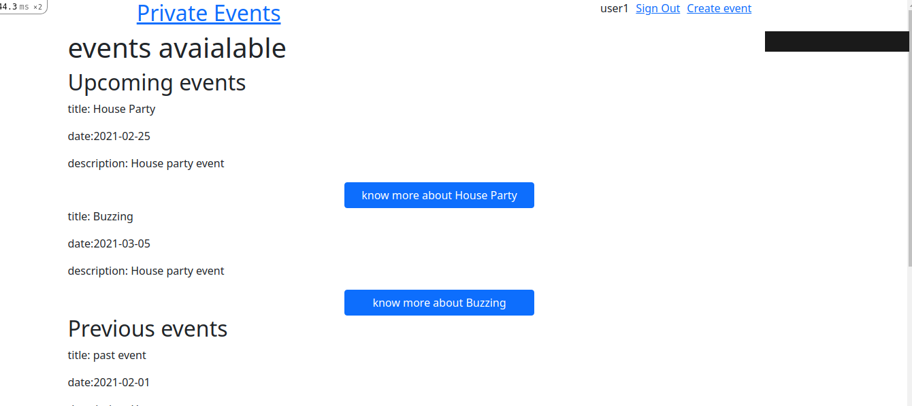
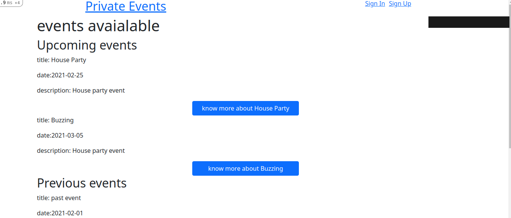

# Private Events

This project is based on building an a platform similar to Eventbrite which allows users to sign up or log in, and create events. While not signed in, users can see all upcoming and past events but user will be required to sign in to create a new event.

**User logged in view**

**User logged out view**

## Private Events project features:

- Not logged users can see a list of all created events
- Logged in users can create events

## Built With

- Ruby on Rails
- Bootstrap
- ruby gems
- VS Code Editor

## Getting Started

### Prerequisites

If you intend to download the project, you will need to have Ruby and Rails already installed on your local machine.

- For more information on how to install Ruby, follow [this link.](https://www.ruby-lang.org/en/downloads/)
- For more information on how to install Rails, follow [this link.](https://guides.rubyonrails.org/getting_started.html/)

### Installation instructions

Follow along the steps below to get a copy on your local machine.

- Navigate to the directory where you want this project to live and then clone it `git clone https://github.com/wandji20/private-events.git`
- Navigate to the `private-events` directory
- Install the gem package with `bundle install`
- Migrate the database on your local machine with `rails db:migrate`
- Start rails server ($ rails server or rails s)
- Open 'localhost:3000' to see platform functionalities.

## Authors

😎 **Helcio André**

- GitHub: [@helciodev](https://github.com/helciodev)
- Twitter: [@helcio_bruno](https://twitter.com/helcio_bruno)
- Linkedin: [Helcio Andre](https://www.linkedin.com/in/helcio-andre/)

👤 **Wandji Bertrand**

- GitHub: [@wandji20](https://github.com/wandji20)
- LinkedIn: [Wandji Bertrand](https://www.linkedin.com/in/wandji-bertrand/)

## 🤝 Contributing

Contributions, issues and feature requests are welcome!

Feel free to check the [issues page](https://github.com/wandji20/private-events/issues).

## Show your support

Give a ⭐️ if you like this project!

## 📝 License

This project is [MIT](/license.txt) licensed.
